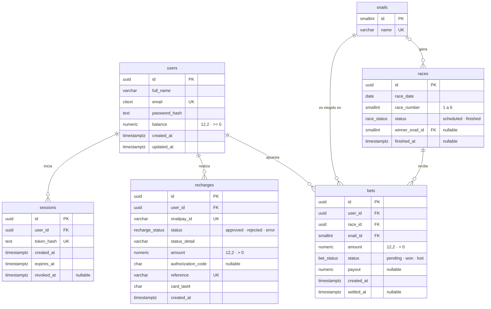

# Propuesta de base de datos.

Hoy la aplicación guarda todo en LocalStorage. Esta propuesta describe cómo se conectaría a una base de datos real. No está implementada.

## Diagrama.

## Qué se guarda.

| Tabla | Contenido |
|---|---|
| `users` | Datos del usuario, hash de la contraseña y saldo. |
| `sessions` | Sesiones activas. Reemplaza la sesión de LocalStorage. |
| `recharges` | Cada intento de recarga con SnailPay, aprobado o no. |
| `snails` | Los 6 caracoles. |
| `races` | Las carreras de cada día y su ganador. |
| `bets` | Las apuestas de cada usuario por carrera y su resultado. |

## Relaciones.

- Un usuario tiene muchas sesiones, recargas y apuestas.
- Una carrera tiene muchas apuestas. Cada apuesta es de un usuario, por un caracol, en una carrera.
- Una carrera tiene un ganador cuando termina. Mientras está programada, `winner_snail_id` es nulo.
- Se borra en cascada solo lo que no tiene valor sin el usuario (`sessions`). Las recargas y apuestas se conservan: son registros financieros.

## Reglas en la base de datos.

- `email` es único y no distingue mayúsculas (`citext`). Hoy esa regla vive en el frontend.
- `(race_date, race_number)` es único: no puede haber dos carreras 3 el mismo día.
- `snailpay_id` y `reference` son únicos: una misma respuesta de SnailPay no se acredita dos veces.
- Montos en `numeric(12,2)`, nunca en flotante: evita errores como `0.1 + 0.2`.
- `balance >= 0` y montos `> 0` con `CHECK`.
- Índices en `bets (user_id, created_at)`, `recharges (user_id, created_at)` y `races (race_date)`. Son las consultas del dashboard.

## Diferencias con lo que hoy guarda LocalStorage.

- **Contraseña.** Solo `password_hash`, con argon2id o bcrypt. Esos formatos incluyen la sal dentro del hash, así que ya no hace falta una columna aparte.
- **Tarjeta.** Solo los últimos 4 dígitos. El número completo y el CVV no se guardan: el estándar PCI DSS prohíbe guardar el CVV después de autorizar el cobro. Hoy se guardan porque la prueba lo pide y son datos ficticios.
- **Sesión.** Se guarda el hash del token, no el token. Si la tabla se filtra, los tokens no sirven.
- **Datos simulados.** Las gráficas dejan de generarse en el navegador: salen de `races` y `bets`.

## Consultas del dashboard.

- Victorias del día: contar `races` por `winner_snail_id` donde `race_date` es hoy. Siempre suman 6 porque cada carrera tiene un ganador.
- Apuestas ganadas y perdidas: contar `bets` del usuario por `status`.
- Saldo: `users.balance`.
- Últimas recargas: `recharges` del usuario ordenadas por `created_at`, con límite de 5.

## Tecnología.

- **PostgreSQL.** Relacional, con transacciones, `CHECK`, `citext` y tipos `enum`. Los datos tienen relaciones claras y el saldo exige consistencia.
- **Proveedor.** Neon o Supabase. Los dos tienen integración con Vercel y un controlador para funciones serverless que no agota las conexiones.
- **ORM.** Prisma: genera tipos de TypeScript desde el esquema y maneja las migraciones.

## Cambios necesarios.

**Backend.**
- Nuevas rutas: registro, login, logout, usuario actual, recargas y datos del dashboard.
- La contraseña se deriva en el servidor, no en el navegador.
- La sesión viaja en una cookie `httpOnly`, `Secure` y `SameSite`. JavaScript no puede leerla.
- La recarga se procesa en el servidor: llama a la lógica de SnailPay y, si se aprueba, guarda la recarga y suma el saldo en **una sola transacción**. Si algo falla, no queda una recarga sin saldo ni un saldo sin recarga.
- Un proceso programado crea las 6 carreras del día y registra al ganador de cada una.

**Frontend.**
- Los servicios llaman al API en vez de leer LocalStorage. Las vistas, los formularios y las gráficas casi no cambian, porque ya solo hablan con los servicios.
- Se eliminan `storage.service`, `password.service` y la simulación del día.
- El frontend deja de calcular el saldo. Solo muestra el que responde el servidor.
